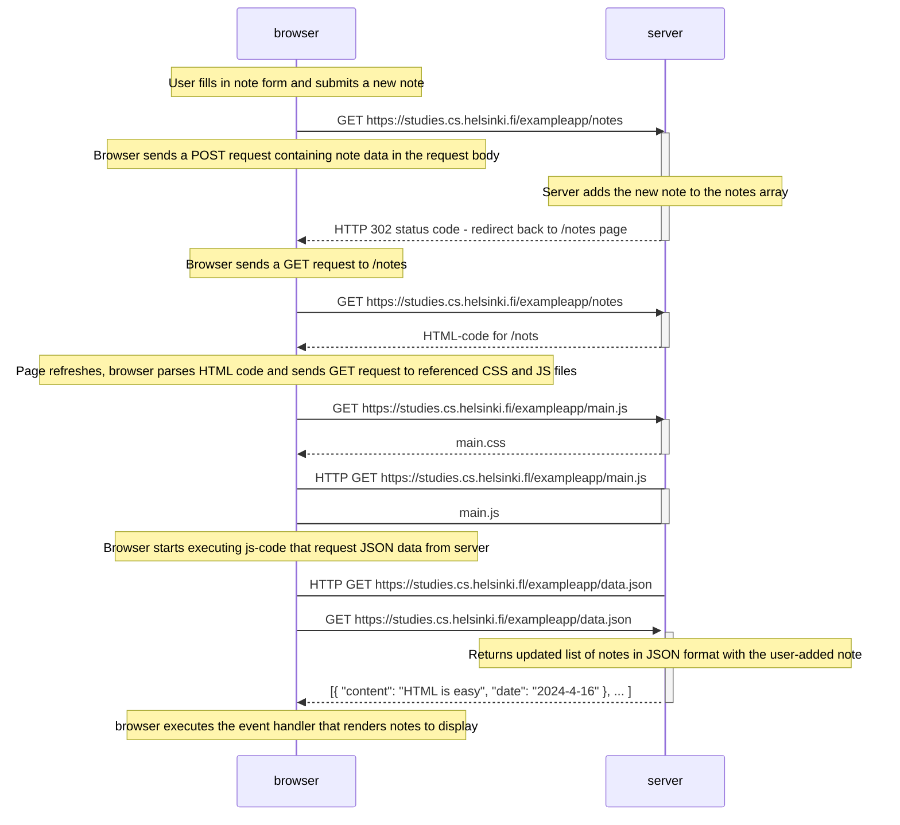

```mermaid
sequenceDiagram
    participant browser
    participant server

    Note over browser: User fills in note form and submits a new note
    browser->>server: GET https://studies.cs.helsinki.fi/exampleapp/notes
    activate server
    Note over browser: Browser sends a POST request containing note data in the request body
    Note over server: Server adds the new note to the notes array
    server-->>browser: HTTP 302 status code - redirect back to /notes page
    deactivate server

    Note over browser:Browser sends a GET request to /notes

    browser->>server: GET https://studies.cs.helsinki.fi/exampleapp/notes
    activate server
    server-->>browser: HTML-code for /nots
    deactivate server

    Note over browser: Page refreshes, browser parses HTML code and sends GET request to referenced CSS and JS files

    browser->>server: GET https://studies.cs.helsinki.fi/exampleapp/main.js
    activate server
    server-->>browser: main.css
    deactivate server
    browser->server: HTTP GET https://studies.cs.helsinki.fl/exampleapp/main.js
    activate server
    server->browser: main.js
    deactivate server

    Note over browser: Browser starts executing js-code that request JSON data from server

    browser->server: HTTP GET https://studies.cs.helsinki.fl/exampleapp/data.json
    activate server

    browser->>server: GET https://studies.cs.helsinki.fi/exampleapp/data.json
    activate server

    Note over server: Returns updated list of notes in JSON format with the user-added note

    server-->>browser: [{ "content": "HTML is easy", "date": "2024-4-16" }, ... ]
    deactivate server

    Note over browser: browser executes the event handler that renders notes to display

```
