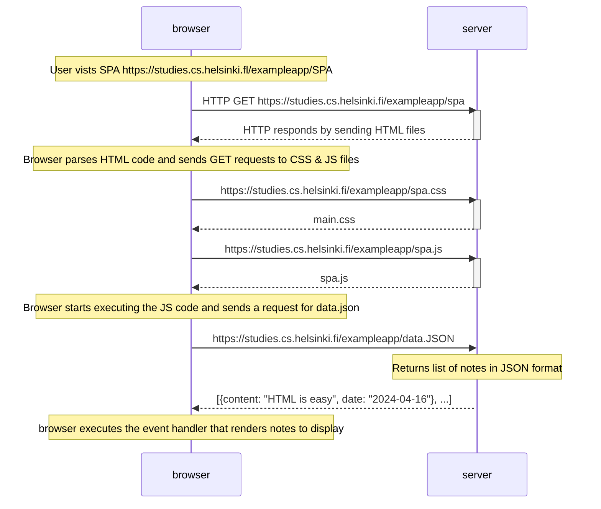

```mermaid
sequenceDiagram
    participant browser
    participant server

    note over browser: User vists SPA https://studies.cs.helsinki.fl/exampleapp/SPA

    browser->>server: HTTP GET https://studies.cs.helsinki.fi/exampleapp/spa
    activate server
    server-->>browser: HTTP responds by sending HTML files
    deactivate server

    note over browser: Browser parses HTML code and sends GET requests to CSS & JS files

    browser->>server: https://studies.cs.helsinki.fi/exampleapp/spa.css
    activate server
    server-->>browser: main.css
    deactivate server
    browser->>server: https://studies.cs.helsinki.fi/exampleapp/spa.js
    activate server
    server-->>browser: spa.js
    deactivate server

    note over browser: Browser starts executing the JS code and sends a request for data.json

    browser->>server: https://studies.cs.helsinki.fi/exampleapp/data.JSON
    activate server

    note over server: Returns list of notes in JSON format

    server-->>browser: [{content: "HTML is easy", date: "2024-04-16"}, ...]

    note over browser: browser executes the event handler that renders notes to display
```
