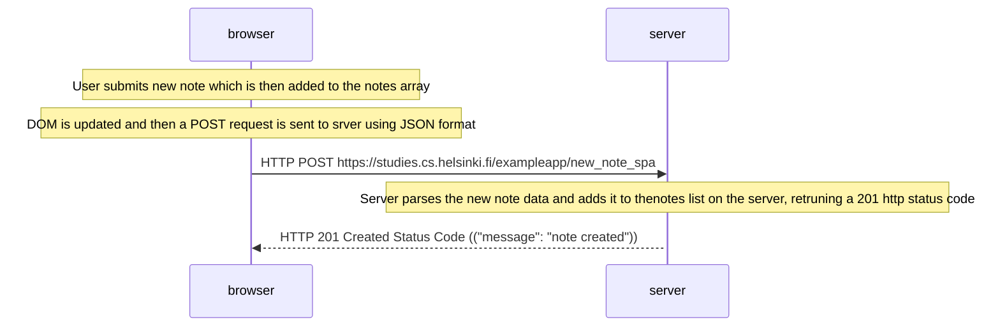

```mermaid
sequenceDiagram
    participant browser
    participant server

    note over browser: User submits new note which is then added to the notes array
    note over browser: DOM is updated and then a POST request is sent to srver using JSON format

    browser->>server: HTTP POST https://studies.cs.helsinki.fi/exampleapp/new_note_spa
    activate server

    note over server: Server parses the new note data and adds it to thenotes list on the server, retruning a 201 http status code

    server-->>browser: HTTP 201 Created Status Code (("message": "note created"))
```
